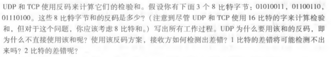

# 第五次作业

2017312580048	 徐意

## UDP校验和计算(python实现)

```
def get(w1,w2,w3):
    w1&=0xffff
    w2&=0xffff
    w3&=0xffff;
    w=w1+w2+w3

    # 回卷
    while w>0xffff:
        w-=0xffff

    # 求反
    w^=0xffff
    print("校验和为%#x" % w)

    # 校验
    w+=w1+w2+w3
    # 回卷
    while w>0xffff:
        w-=0xffff
    print("相加为%#x" % w)

# 课本例子
get(0x6660,0x5555,0x8F0A)
# 
get(0x6230,0xDC22,0x8BEA)
```

以上代码的输出为：

```
校验和为0xb53f
相加为0xffff
校验和为0x35c2
相加为0xffff
```

## 课后习题

### P3




```
0101 0011 + 0110 0110 = 1011 1001

1011 1001 + 0111 0100 = 0010 1110 (由1 0010 1101回卷)

取反得：1101 0001

采用反码方案，不必依赖系统是大端还是小端
差错检验方法：将收到的数据与检验和相加，所得的结果如果有任一位为0，即为出错。
1比特的差错不可能检测不出，2比特的差错可能检测不出。
```

### P4


```
a.	0101 1100 + 0110 0101 = 1100 0001
	取反得：0011 1110
	
b.	1101 1010 + 0110 0101 = 0100 0000 (由1 0011 1111回卷) 
	取反得：1011 1111
	
c.	第四位反转：0100 1100,0111 0101
	0100 1100 + 0111 0101 = 1100 0001
	取反得：0011 1110
	与（a）中反码相同
	
```

